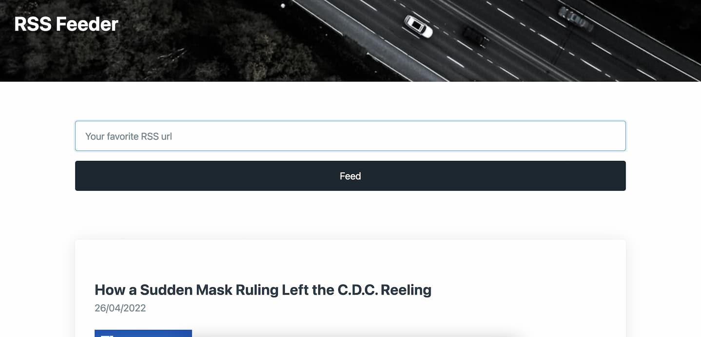

# PHP Simple Web Form

## Demo

[Live Demo on heroku](https://php03-rssfeeder.herokuapp.com/)

## Description

Let's build an RSS feed reader!

This Project is suggested by [codementor.io](https://www.codementor.io/projects/web/rss-feed-reader-website-atx32j280x)
This is the third project I build while learning PHP.

## Requirements

-   The user can input a RSS feed URL.
-   The reader will display the title, description, and link of the original content.

### Extra challenge:

-   The user can add more than one RSS feed URL.
-   Instead of using a RSS parser library, build the parser yourse

## Made with...

-   [Pico.css](https://picocss.com/) - Framework CSS (front-end)

Photo by <a href="https://unsplash.com/@glebson?utm_source=unsplash&utm_medium=referral&utm_content=creditCopyText">Gleb Kozenko</a> on <a href="https://unsplash.com/s/photos/toronto?utm_source=unsplash&utm_medium=referral&utm_content=creditCopyText">Unsplash</a>
